# 👨‍💼 Maintain and Build

**Jesus M. Ayala - ITS Help Desk Manager, Sarah Lawrence College**

> For bugs or enhancements, please open an issue.

---

# 🖨️ NetworkPrinter macOS Application

NetworkPrinter is a macOS application designed to help users discover and install printers shared via **SMB/CIFS (Windows) print servers** and locally attached **USB** printers. The application features a modern SwiftUI interface with comprehensive driver selection capabilities and is built to robustly read and apply settings managed via configuration profiles.

> **Scope**: This app targets **SMB/CIFS and USB only**. It is **not** an IPP/AirPrint client — there is no IPP, IPPS, or AirPrint discovery or installation path.


---

## ✨ Features

* **🎨 Modern SwiftUI Interface**: Clean, intuitive design with smooth animations and responsive layouts
* **🔍 Printer Discovery**: Concurrently discovers SMB/CIFS print-server queues and local USB printers, de-duplicated centrally
* **🧠 Hybrid Driver Detection**: IT mapping wins; unmapped SMB printers auto-resolve via share-comment model parsing + fuzzy `lpinfo -m` matching, with generic + manual picker only as a last resort — mapping is now fallback-optional
* **🎫 Kerberos / Single Sign-On**: On a Mac with a valid Kerberos ticket, browses and installs SMB queues passwordless; falls back to username/password
* **🧑‍💼 Standard-User Installs**: A signed `SMAppService` privileged helper lets non-admins install/remove printers; admins install directly
* **🛡️ Enforced MDM Policy**: `AllowUserInstall` / `AllowUserUninstall` / `AllowUserServerChange` / `RequireAuthentication` are now enforced, not just stored
* **⚙️ Working Auto-Install**: `AutoInstallPrinters` with `AutoInstallPrinterNames` scoping (empty list = configured-server SMB queues only, never USB)
* **📡 Real-time Status Updates**: Live printer status monitoring and installation progress tracking
* **🔐 Credential Hygiene**: Passwords never appear in process arguments or device URIs; logs are credential-redacted
* **🪵 Gated Logging**: Detailed file logging controlled by `EnableDetailedLogging`; errors always logged

---

## 🏗️ Architecture

The app is built using a modern, modular service-based architecture:

* **PrinterManager**: Handles discovery, installation, and status updates
* **PreferencesManager**: Reads and manages both local and MDM-supplied preferences
* **Service Layer**: Modular services for discovery, installation, and driver operations
* **UI Components**: SwiftUI-based views like `PrinterListView`, `DriverSelectionView`, `PrinterHeaderView`
* **Styling System**: Unified design language with consistent colors, fonts, and components

---

## 🧠 How Driver Detection Works (Hybrid)

Mapping is now **fallback-optional** — you no longer have to map every printer. The IT mapping table (MDM `PrinterDriverMappings`, a remote JSON/CSV endpoint, or a Google Sheet) is still the **highest-priority** source and an explicit entry always wins, but it is now a convenience for overrides and edge cases rather than a hard requirement.

Driver resolution order:

1. **IT driver mapping (highest priority)** — an exact/fuzzy entry from MDM, the remote endpoint, or the Google Sheet always wins. Use it for overrides.
2. **SMB print-server queues** — the app parses the printer model out of the share **comment/location** text (e.g. `Financial Aid HP LaserJet P3015n`) and **fuzzy-matches** it against the CUPS driver database (`lpinfo -m`). The tokenized score weights model numbers and tolerates suffixes, so `P3015n` matches the `HP LaserJet P3015` PPD.
3. **SNMP** is only queried against a real **printer IP**, never against an SMB print server.
4. **Generic driver + manual picker (last resort)** — used **only** when nothing above clears the confidence threshold. Unmapped printers are no longer given a generic driver by default (`AllowFallbackWithGenericSuggestion` still gates whether generic is offered).

See **[NetworkPrinter_Driver_Mapping_Guide.md](./NetworkPrinter_Driver_Mapping_Guide.md)** for the full mapping guide.

---

## 🎫 Authentication: Kerberos / SSO, Reused Credentials, Standard Users

* **Kerberos / single sign-on** — on a machine with a valid Kerberos ticket, the app **skips the password prompt**, browses SMB **passwordless**, and installs SMB queues using `auth-info-required=negotiate` with no password stored. The authentication mode is **re-evaluated before each discovery/install/remove** (re-checking `klist` and validating the ticket's realm against the configured domain) rather than latched at launch — so a ticket that expires mid-session cleanly falls back to a username/password sign-in instead of configuring a queue for stale credentials, and mismatches surface as distinct **"ticket expired"** vs **"realm mismatch"** errors.
* **Reused domain credentials** — validated domain credentials are stored in the Keychain and reused on next launch (subject to `RequireAuthentication` and Kerberos), so users aren't re-prompted every time.
* **Standard-user installs via a privileged helper** — a bundled `SMAppService` LaunchDaemon (`com.ayala.solutions.NetworkPrinter.installhelper`) with a code-signing-pinned XPC interface lets standard (non-admin) users install and remove printers. It requires a **signed & notarized build** (the helper embeds an `Info.plist` so its signed identity matches the app's code-signing requirement) and a **one-time approval** (System Settings › Login Items, or pre-approved via an MDM Managed Login Items profile keyed on the app's Team ID). **Admins** install directly and need no setup. A **standard user** whose helper isn't yet approved gets an actionable *"open Login Items"* message rather than a silent failure. XPC calls are bounded by a timeout so an unreachable helper can't hang the UI. Server-side, the daemon builds the `lpadmin` arguments itself from validated pieces (name, device-URI scheme, driver confirmed against `lpinfo -m`) and stages PPDs into a root-owned temp file — it never accepts raw arguments or credentials.
* **Credential hygiene** — passwords are never placed in command arguments or persisted CUPS device URIs. The `security` keychain command reads its input from stdin, and log output is credential-redacted (URI `user:pass@`, `//DOMAIN;user:pass`, `-w`/`--password`, `PASSWD`-style env names, and Google API keys).

---

## ⚙️ Auto-Install Behavior

`AutoInstallPrinters` now actually installs printers. Scope is controlled by `AutoInstallPrinterNames`:

* **Names listed** → only those printers are auto-installed (case-insensitive match).
* **List empty** → only printers **published by the configured print server(s)** are auto-installed — never ad-hoc discoveries and **never USB**.

`AutoInstallDefaultPrinter` is set as the system default when it matches an installed printer. Auto-install is idempotent within a session. Discovery is **concurrent** (SMB and USB sources run in parallel and are de-duplicated), and a refresh finishes before the UI reports success; when every source fails the app surfaces a real error instead of an empty list.

---

## 🚀 Configuration Setup

### 📘 Quick Start Guide

1. Copy the file: `NetworkPrinter/Resources/NetworkPrinterSettings.mobileconfig`
2. Edit placeholders:

   * `<string>Your Organization</string>` → `<string>Acme Corporation</string>`
   * Replace `YOUR_PRINTSERVER_HOSTNAME_OR_IP` and other placeholders
3. Deploy via MDM (Jamf, Intune, etc.) or manually:
   ```bash
   sudo profiles -I -F NetworkPrinterSettings.mobileconfig
   ```

### 🔧 Complete Configuration Examples

#### 🏢 Example 1: Small Business Setup

**Scenario**: Small business with one print server, allowing user flexibility

```xml
<?xml version="1.0" encoding="UTF-8"?>
<!DOCTYPE plist PUBLIC "-//Apple//DTD PLIST 1.0//EN" "http://www.apple.com/DTDs/PropertyList-1.0.dtd">
<plist version="1.0">
<dict>
    <key>PayloadDisplayName</key>
    <string>Network Printer Settings</string>
    <key>PayloadIdentifier</key>
    <string>com.acmecorp.networkprinter.configuration</string>
    <key>PayloadOrganization</key>
    <string>Acme Corporation</string>
    <key>PayloadRemovalDisallowed</key>
    <false/>
    <key>PayloadScope</key>
    <string>System</string>
    <key>PayloadType</key>
    <string>Configuration</string>
    <key>PayloadUUID</key>
    <string>12345678-1234-1234-1234-123456789012</string>
    <key>PayloadVersion</key>
    <integer>1</integer>
    <key>PayloadContent</key>
    <array>
        <dict>
            <key>PayloadDescription</key>
            <string>Configures Network Printer application settings</string>
            <key>PayloadDisplayName</key>
            <string>Network Printer App Preferences</string>
            <key>PayloadIdentifier</key>
            <string>com.networkprinter.preferences</string>
            <key>PayloadOrganization</key>
            <string>Acme Corporation</string>
            <key>PayloadType</key>
            <string>com.apple.ManagedClient.preferences</string>
            <key>PayloadUUID</key>
            <string>12345678-1234-1234-1234-123456789013</string>
            <key>PayloadVersion</key>
            <integer>1</integer>
            <key>PayloadEnabled</key>
            <true/>
            <key>PayloadContent</key>
            <dict>
                <key>com.networkprinter.preferences</key>
                <dict>
                    <key>Forced</key>
                    <array>
                        <dict>
                            <key>mcx_preference_settings</key>
                            <dict>
                                <!-- Basic server configuration -->
                                <key>PrintServerHost</key>
                                <string>printserver.acmecorp.com</string>
                                <key>PrintServerPort</key>
                                <integer>445</integer>
                                <key>PrintServerDomain</key>
                                <string>ACME</string>
                                
                                <!-- User authentication -->
                                <key>RequireAuthentication</key>
                                <true/>
                                <key>DefaultDomain</key>
                                <string>ACME</string>
                                
                                <!-- User permissions (flexible) -->
                                <key>AllowUserServerChange</key>
                                <true/>
                                <key>AllowUserInstall</key>
                                <true/>
                                <key>AllowUserUninstall</key>
                                <true/>
                                
                                <!-- Installation preferences -->
                                <key>AutoInstallPrinters</key>
                                <false/>
                                <!-- Empty: only configured-server SMB queues auto-install (never USB) -->
                                <key>AutoInstallPrinterNames</key>
                                <array/>
                                <key>AutoInstallDefaultPrinter</key>
                                <string></string>
                                
                                <!-- Troubleshooting -->
                                <key>EnableDetailedLogging</key>
                                <false/>
                                <key>AllowFallbackWithGenericSuggestion</key>
                                <true/>
                                
                                <!-- Basic driver mappings -->
                                <key>PrinterDriverMappings</key>
                                <dict>
                                    <key>Office-HP-LaserJet</key>
                                    <string>/Library/Printers/PPDs/Contents/Resources/HP LaserJet Pro 4015n.ppd.gz</string>
                                    <key>Reception-Canon-Copier</key>
                                    <string>/Library/Printers/PPDs/Contents/Resources/Canon iR-ADV C5535i PS.ppd.gz</string>
                                </dict>
                                
                                <!-- Remote management disabled -->
                                <key>DriverMappingsURL</key>
                                <string></string>
                                <key>GoogleSheetsID</key>
                                <string></string>
                                <key>GoogleSheetsAPIKey</key>
                                <string></string>
                                <key>GoogleSheetsRange</key>
                                <string>printers!A:B</string>
                            </dict>
                        </dict>
                    </array>
                </dict>
            </dict>
        </dict>
    </array>
</dict>
</plist>
```

**Key Features**:
- Users can modify server settings if needed
- Authentication required with pre-filled domain
- Manual printer selection (no auto-install)
- Basic driver mappings for common printers
- Fallback to generic drivers allowed

---

#### 🏭 Example 2: Enterprise Lock-Down

**Scenario**: Large enterprise with strict IT control, no user modifications allowed

```xml
<?xml version="1.0" encoding="UTF-8"?>
<!DOCTYPE plist PUBLIC "-//Apple//DTD PLIST 1.0//EN" "http://www.apple.com/DTDs/PropertyList-1.0.dtd">
<plist version="1.0">
<dict>
    <key>PayloadDisplayName</key>
    <string>Enterprise Network Printer Settings</string>
    <key>PayloadIdentifier</key>
    <string>com.enterprise.networkprinter.configuration</string>
    <key>PayloadOrganization</key>
    <string>Enterprise Corp</string>
    <key>PayloadRemovalDisallowed</key>
    <true/>
    <key>PayloadScope</key>
    <string>System</string>
    <key>PayloadType</key>
    <string>Configuration</string>
    <key>PayloadUUID</key>
    <string>87654321-4321-4321-4321-210987654321</string>
    <key>PayloadVersion</key>
    <integer>1</integer>
    <key>PayloadContent</key>
    <array>
        <dict>
            <key>PayloadDescription</key>
            <string>Locked enterprise printer configuration</string>
            <key>PayloadDisplayName</key>
            <string>Enterprise Printer Settings</string>
            <key>PayloadIdentifier</key>
            <string>com.networkprinter.preferences</string>
            <key>PayloadOrganization</key>
            <string>Enterprise Corp</string>
            <key>PayloadType</key>
            <string>com.apple.ManagedClient.preferences</string>
            <key>PayloadUUID</key>
            <string>87654321-4321-4321-4321-210987654322</string>
            <key>PayloadVersion</key>
            <integer>1</integer>
            <key>PayloadEnabled</key>
            <true/>
            <key>PayloadContent</key>
            <dict>
                <key>com.networkprinter.preferences</key>
                <dict>
                    <key>Forced</key>
                    <array>
                        <dict>
                            <key>mcx_preference_settings</key>
                            <dict>
                                <!-- Locked server configuration -->
                                <key>PrintServerHost</key>
                                <string>corpprint01.enterprise.local</string>
                                <key>PrintServerPort</key>
                                <integer>445</integer>
                                <key>PrintServerDomain</key>
                                <string>ENTERPRISE</string>
                                
                                <!-- Domain authentication -->
                                <key>RequireAuthentication</key>
                                <true/>
                                <key>DefaultDomain</key>
                                <string>ENTERPRISE</string>
                                
                                <!-- Strict user permissions -->
                                <key>AllowUserServerChange</key>
                                <false/>
                                <key>AllowUserInstall</key>
                                <true/>
                                <key>AllowUserUninstall</key>
                                <false/>
                                
                                <!-- No auto-install -->
                                <key>AutoInstallPrinters</key>
                                <false/>
                                <!-- Empty: only configured-server SMB queues auto-install (never USB) -->
                                <key>AutoInstallPrinterNames</key>
                                <array/>
                                <key>AutoInstallDefaultPrinter</key>
                                <string></string>
                                
                                <!-- Controlled troubleshooting -->
                                <key>EnableDetailedLogging</key>
                                <false/>
                                <key>AllowFallbackWithGenericSuggestion</key>
                                <false/>
                                
                                <!-- Comprehensive driver mappings -->
                                <key>PrinterDriverMappings</key>
                                <dict>
                                    <key>CORP-HP-4015-FL1</key>
                                    <string>/Library/Printers/PPDs/Contents/Resources/HP LaserJet Pro 4015n.ppd.gz</string>
                                    <key>CORP-CANON-5535-FL2</key>
                                    <string>/Library/Printers/PPDs/Contents/Resources/Canon iR-ADV C5535i PS.ppd.gz</string>
                                    <key>CORP-XEROX-7835-FL3</key>
                                    <string>/Library/Printers/PPDs/Contents/Resources/Xerox WorkCentre 7835.ppd.gz</string>
                                    <key>CORP-BROTHER-L2350-FL4</key>
                                    <string>/Library/Printers/PPDs/Contents/Resources/Brother HL-L2350DW.ppd.gz</string>
                                    <key>CORP-RICOH-MP6503-FL5</key>
                                    <string>/Library/Printers/PPDs/Contents/Resources/Ricoh MP 6503.ppd.gz</string>
                                </dict>
                                
                                <!-- Google Sheets for dynamic updates -->
                                <key>DriverMappingsURL</key>
                                <string></string>
                                <key>GoogleSheetsID</key>
                                <string>YOUR_GOOGLE_SHEETS_ID</string>
                                <key>GoogleSheetsAPIKey</key>
                                <string>YOUR_GOOGLE_SHEETS_API_KEY</string>
                                <key>GoogleSheetsRange</key>
                                <string>PrinterDrivers!A:B</string>
                            </dict>
                        </dict>
                    </array>
                </dict>
            </dict>
        </dict>
    </array>
</dict>
</plist>
```

**Key Features**:
- Server settings locked (cannot be changed by users)
- Users can install but not uninstall printers
- Comprehensive driver mappings
- Google Sheets integration for dynamic updates
- Profile removal not allowed
- No fallback to generic drivers

---

#### 🧑‍💻 Example 3: Kiosk/Lab Auto-Install

**Scenario**: Computer labs or kiosks with automatic printer installation

```xml
<?xml version="1.0" encoding="UTF-8"?>
<!DOCTYPE plist PUBLIC "-//Apple//DTD PLIST 1.0//EN" "http://www.apple.com/DTDs/PropertyList-1.0.dtd">
<plist version="1.0">
<dict>
    <key>PayloadDisplayName</key>
    <string>Lab Auto-Install Printer Settings</string>
    <key>PayloadIdentifier</key>
    <string>com.university.lab.networkprinter.configuration</string>
    <key>PayloadOrganization</key>
    <string>University Computer Lab</string>
    <key>PayloadRemovalDisallowed</key>
    <true/>
    <key>PayloadScope</key>
    <string>System</string>
    <key>PayloadType</key>
    <string>Configuration</string>
    <key>PayloadUUID</key>
    <string>11111111-2222-3333-4444-555555555555</string>
    <key>PayloadVersion</key>
    <integer>1</integer>
    <key>PayloadContent</key>
    <array>
        <dict>
            <key>PayloadDescription</key>
            <string>Auto-install lab printers</string>
            <key>PayloadDisplayName</key>
            <string>Lab Printer Auto-Install</string>
            <key>PayloadIdentifier</key>
            <string>com.networkprinter.preferences</string>
            <key>PayloadOrganization</key>
            <string>University Computer Lab</string>
            <key>PayloadType</key>
            <string>com.apple.ManagedClient.preferences</string>
            <key>PayloadUUID</key>
            <string>11111111-2222-3333-4444-555555555556</string>
            <key>PayloadVersion</key>
            <integer>1</integer>
            <key>PayloadEnabled</key>
            <true/>
            <key>PayloadContent</key>
            <dict>
                <key>com.networkprinter.preferences</key>
                <dict>
                    <key>Forced</key>
                    <array>
                        <dict>
                            <key>mcx_preference_settings</key>
                            <dict>
                                <!-- Lab server configuration -->
                                <key>PrintServerHost</key>
                                <string>labprint.university.edu</string>
                                <key>PrintServerPort</key>
                                <integer>445</integer>
                                <key>PrintServerDomain</key>
                                <string>UNIVERSITY</string>
                                
                                <!-- No authentication required -->
                                <key>RequireAuthentication</key>
                                <false/>
                                <key>DefaultDomain</key>
                                <string></string>
                                
                                <!-- No user control -->
                                <key>AllowUserServerChange</key>
                                <false/>
                                <key>AllowUserInstall</key>
                                <false/>
                                <key>AllowUserUninstall</key>
                                <false/>
                                
                                <!-- Full auto-install -->
                                <key>AutoInstallPrinters</key>
                                <true/>
                                <!-- Empty: only configured-server SMB queues auto-install (never USB) -->
                                <key>AutoInstallPrinterNames</key>
                                <array/>
                                <key>AutoInstallDefaultPrinter</key>
                                <string>LAB-MAIN-PRINTER</string>
                                
                                <!-- Minimal logging -->
                                <key>EnableDetailedLogging</key>
                                <false/>
                                <key>AllowFallbackWithGenericSuggestion</key>
                                <true/>
                                
                                <!-- Lab printer mappings -->
                                <key>PrinterDriverMappings</key>
                                <dict>
                                    <key>LAB-MAIN-PRINTER</key>
                                    <string>/Library/Printers/PPDs/Contents/Resources/HP LaserJet Pro 4015n.ppd.gz</string>
                                    <key>LAB-COLOR-PRINTER</key>
                                    <string>/Library/Printers/PPDs/Contents/Resources/Canon iR-ADV C5535i PS.ppd.gz</string>
                                    <key>LAB-PLOTTER</key>
                                    <string>/Library/Printers/PPDs/Contents/Resources/HP DesignJet T730.ppd.gz</string>
                                </dict>
                                
                                <!-- No remote management -->
                                <key>DriverMappingsURL</key>
                                <string></string>
                                <key>GoogleSheetsID</key>
                                <string></string>
                                <key>GoogleSheetsAPIKey</key>
                                <string></string>
                                <key>GoogleSheetsRange</key>
                                <string>printers!A:B</string>
                            </dict>
                        </dict>
                    </array>
                </dict>
            </dict>
        </dict>
    </array>
</dict>
</plist>
```

**Key Features**:
- Automatic installation of all discovered printers
- No user authentication required
- Sets specific printer as default
- Users cannot modify any settings
- Minimal logging for performance
- Profile removal not allowed

---

#### 🌐 Example 4: Remote JSON Driver Management

**Scenario**: IT manages driver mappings via remote JSON endpoint

```xml
<?xml version="1.0" encoding="UTF-8"?>
<!DOCTYPE plist PUBLIC "-//Apple//DTD PLIST 1.0//EN" "http://www.apple.com/DTDs/PropertyList-1.0.dtd">
<plist version="1.0">
<dict>
    <key>PayloadDisplayName</key>
    <string>Remote Managed Printer Settings</string>
    <key>PayloadIdentifier</key>
    <string>com.techcorp.remote.networkprinter.configuration</string>
    <key>PayloadOrganization</key>
    <string>TechCorp</string>
    <key>PayloadRemovalDisallowed</key>
    <false/>
    <key>PayloadScope</key>
    <string>System</string>
    <key>PayloadType</key>
    <string>Configuration</string>
    <key>PayloadUUID</key>
    <string>99999999-8888-7777-6666-555555555555</string>
    <key>PayloadVersion</key>
    <integer>1</integer>
    <key>PayloadContent</key>
    <array>
        <dict>
            <key>PayloadDescription</key>
            <string>Remote JSON driver management</string>
            <key>PayloadDisplayName</key>
            <string>Remote Printer Management</string>
            <key>PayloadIdentifier</key>
            <string>com.networkprinter.preferences</string>
            <key>PayloadOrganization</key>
            <string>TechCorp</string>
            <key>PayloadType</key>
            <string>com.apple.ManagedClient.preferences</string>
            <key>PayloadUUID</key>
            <string>99999999-8888-7777-6666-555555555556</string>
            <key>PayloadVersion</key>
            <integer>1</integer>
            <key>PayloadEnabled</key>
            <true/>
            <key>PayloadContent</key>
            <dict>
                <key>com.networkprinter.preferences</key>
                <dict>
                    <key>Forced</key>
                    <array>
                        <dict>
                            <key>mcx_preference_settings</key>
                            <dict>
                                <!-- Server configuration -->
                                <key>PrintServerHost</key>
                                <string>printserver.techcorp.com</string>
                                <key>PrintServerPort</key>
                                <integer>445</integer>
                                <key>PrintServerDomain</key>
                                <string>TECHCORP</string>
                                
                                <!-- Authentication -->
                                <key>RequireAuthentication</key>
                                <true/>
                                <key>DefaultDomain</key>
                                <string>TECHCORP</string>
                                
                                <!-- Balanced user permissions -->
                                <key>AllowUserServerChange</key>
                                <false/>
                                <key>AllowUserInstall</key>
                                <true/>
                                <key>AllowUserUninstall</key>
                                <true/>
                                
                                <!-- No auto-install -->
                                <key>AutoInstallPrinters</key>
                                <false/>
                                <!-- Empty: only configured-server SMB queues auto-install (never USB) -->
                                <key>AutoInstallPrinterNames</key>
                                <array/>
                                <key>AutoInstallDefaultPrinter</key>
                                <string></string>
                                
                                <!-- Detailed logging for troubleshooting -->
                                <key>EnableDetailedLogging</key>
                                <true/>
                                <key>AllowFallbackWithGenericSuggestion</key>
                                <true/>
                                
                                <!-- Minimal local mappings (fallback) -->
                                <key>PrinterDriverMappings</key>
                                <dict>
                                    <key>FALLBACK-GENERIC</key>
                                    <string>/Library/Printers/PPDs/Contents/Resources/Generic PostScript Printer.ppd</string>
                                </dict>
                                
                                <!-- Remote JSON management -->
                                <key>DriverMappingsURL</key>
                                <string>https://it.techcorp.com/printer-drivers/mappings.json</string>
                                <key>GoogleSheetsID</key>
                                <string></string>
                                <key>GoogleSheetsAPIKey</key>
                                <string></string>
                                <key>GoogleSheetsRange</key>
                                <string>printers!A:B</string>
                            </dict>
                        </dict>
                    </array>
                </dict>
            </dict>
        </dict>
    </array>
</dict>
</plist>
```

**Key Features**:
- Remote JSON endpoint for driver mappings
- Detailed logging enabled for troubleshooting
- Fallback to generic drivers allowed
- Local fallback mappings for offline scenarios
- Users can install/uninstall but not change server

**JSON Format Example** (`https://it.techcorp.com/printer-drivers/mappings.json`):
```json
{
  "CORP-HP-4015-FL1": "/Library/Printers/PPDs/Contents/Resources/HP LaserJet Pro 4015n.ppd.gz",
  "CORP-CANON-5535-FL2": "/Library/Printers/PPDs/Contents/Resources/Canon iR-ADV C5535i PS.ppd.gz",
  "CORP-XEROX-7835-FL3": "/Library/Printers/PPDs/Contents/Resources/Xerox WorkCentre 7835.ppd.gz",
  "CORP-NEW-PRINTER": "/Library/Printers/PPDs/Contents/Resources/NewPrinter.ppd.gz"
}
```

---

### 📝 Configuration Profile Setup Steps

#### Step 1: Generate UUIDs
Generate unique UUIDs for your configuration:
```bash
# Generate UUID for main payload
uuidgen
# Generate UUID for preferences payload  
uuidgen
```

#### Step 2: Customize Organization Details
Replace these placeholders in your chosen example:

- `PayloadOrganization`: Your organization name
- `PayloadIdentifier`: Your unique identifier (e.g., `com.yourcompany.networkprinter`)
- `PayloadDisplayName`: Descriptive name for the profile

#### Step 3: Configure Server Settings
Set your print server details:
```xml
<key>PrintServerHost</key>
<string>your-print-server.domain.com</string>
<key>PrintServerPort</key>
<integer>445</integer>
<key>PrintServerDomain</key>
<string>YOUR-DOMAIN</string>
```

#### Step 4: Set User Permissions
Choose appropriate permissions for your environment:
```xml
<!-- Locked down -->
<key>AllowUserServerChange</key>
<false/>
<key>AllowUserInstall</key>
<true/>
<key>AllowUserUninstall</key>
<false/>

<!-- Flexible -->
<key>AllowUserServerChange</key>
<true/>
<key>AllowUserInstall</key>
<true/>
<key>AllowUserUninstall</key>
<true/>
```

#### Step 5: Configure Driver Mappings
Choose your driver management strategy:

**Option A: Static mappings in profile**
```xml
<key>PrinterDriverMappings</key>
<dict>
    <key>PRINTER-NAME</key>
    <string>/Library/Printers/PPDs/Contents/Resources/Driver.ppd.gz</string>
</dict>
```

**Option B: Remote JSON**
```xml
<key>DriverMappingsURL</key>
<string>https://your-domain.com/printer-drivers.json</string>
```

**Option C: Google Sheets**
```xml
<key>GoogleSheetsID</key>
<string>YOUR-GOOGLE-SHEET-ID</string>
<key>GoogleSheetsAPIKey</key>
<string>YOUR-API-KEY</string>
<key>GoogleSheetsRange</key>
<string>printers!A:B</string>
```

#### Step 6: Set Installation Behavior
Configure how printers are installed:
```xml
<!-- Manual installation -->
<key>AutoInstallPrinters</key>
<false/>

<!-- Automatic installation -->
<key>AutoInstallPrinters</key>
<true/>
<key>AutoInstallDefaultPrinter</key>
<string>MAIN-OFFICE-PRINTER</string>
```

#### Step 7: Deploy Profile
Deploy using your MDM or manually:
```bash
# Manual deployment
sudo profiles -I -F YourNetworkPrinterSettings.mobileconfig

# Verify deployment
profiles -P | grep networkprinter

# Check settings
defaults read com.networkprinter.preferences
```

---

### 🎯 Configuration Decision Matrix

| Requirement | Small Business | Enterprise | Kiosk/Lab | Remote Managed |
|-------------|---------------|------------|-----------|----------------|
| **User can change server** | ✅ | ❌ | ❌ | ❌ |
| **User can install printers** | ✅ | ✅ | ❌ | ✅ |
| **User can uninstall printers** | ✅ | ❌ | ❌ | ✅ |
| **Auto-install all printers** | ❌ | ❌ | ✅ | ❌ |
| **Authentication required** | ✅ | ✅ | ❌ | ✅ |
| **Detailed logging** | ❌ | ❌ | ❌ | ✅ |
| **Profile removal allowed** | ✅ | ❌ | ❌ | ✅ |
| **Driver management** | Static | Static + Sheets | Static | Remote JSON |
| **Fallback drivers** | ✅ | ❌ | ✅ | ✅ |

### 🔧 Common Use Cases

#### 🏢 Use Case 1: Small Business

* 50 employees, one print server, user authentication allowed

#### 🏭 Use Case 2: Enterprise Control

* 500+ users, predefined drivers, no user changes allowed

#### 🧑‍💻 Use Case 3: Lab/Kiosk

* Auto-install, no user interaction

#### 🌐 Use Case 4: Remote Driver Management

* Use remote JSON or Google Sheets to manage driver mappings

---

## 🔑 Configuration Key Reference

### Server Configuration

| Key                 | Type    | Description                 |
| ------------------- | ------- | --------------------------- |
| `PrintServerHost`   | String  | Hostname/IP of print server |
| `PrintServerPort`   | Integer | SMB port (default: 445)     |
| `PrintServerDomain` | String  | Auth domain for SMB         |

### Authentication

| Key                     | Type    | Description            |
| ----------------------- | ------- | ---------------------- |
| `RequireAuthentication` | Boolean | Prompt for user creds  |
| `DefaultDomain`         | String  | Default domain prefill |

### 🔐 Domain Configuration & Authentication

The application supports comprehensive domain configuration to streamline user authentication:

#### Domain Settings Overview

| Setting | Purpose | User Experience |
|---------|---------|-----------------|
| `PrintServerDomain` | Server's domain for SMB connections | Used internally for server communication |
| `DefaultDomain` | Pre-fills authentication dialog | Users see this value in the domain field |

#### Authentication Flow

1. **When authentication is required**, the app presents a login dialog
2. **Domain field is automatically pre-filled** with the `DefaultDomain` value
3. **Users can modify the domain** unless the setting is managed by MDM
4. **Domain validation** occurs before attempting printer discovery

#### Configuration Examples

**Example 1: Corporate Domain**
```xml
<key>PrintServerDomain</key>
<string>CORP</string>
<key>DefaultDomain</key>
<string>CORP</string>
<key>RequireAuthentication</key>
<true/>
```

**Example 2: Active Directory Domain**
```xml
<key>PrintServerDomain</key>
<string>ACME.LOCAL</string>
<key>DefaultDomain</key>
<string>ACME</string>
<key>RequireAuthentication</key>
<true/>
```

**Example 3: No Authentication Required**
```xml
<key>PrintServerDomain</key>
<string></string>
<key>DefaultDomain</key>
<string></string>
<key>RequireAuthentication</key>
<false/>
```

#### User Experience Benefits

- **Reduced friction**: Users don't need to remember domain names
- **Consistent authentication**: Same domain used across all printer operations
- **Error prevention**: Pre-configured domains reduce authentication failures
- **MDM control**: IT can lock domain settings to prevent user changes

#### Common Domain Configurations

| Scenario | PrintServerDomain | DefaultDomain | Notes |
|----------|-------------------|---------------|-------|
| Windows domain | `DOMAIN` | `DOMAIN` | Typical AD setup |
| FQDN domain | `company.local` | `company` | Often shorter for user entry |
| Workgroup | `WORKGROUP` | `WORKGROUP` | Local network setup |
| No domain | `""` | `""` | Anonymous access |

#### Domain Authentication Troubleshooting

**Common Issues:**
- **Domain not found**: Verify `PrintServerDomain` matches your network configuration
- **Authentication failures**: Check that `DefaultDomain` is correct for your environment
- **User confusion**: Use shorter domain names in `DefaultDomain` for better UX

**Testing Domain Configuration:**
```bash
# Check configured domain
defaults read com.networkprinter.preferences DefaultDomain

# Test SMB connection with domain
smbutil view -I 192.168.1.100 -W DOMAIN //username@server
```

### Installation

| Key                                  | Type    | Description                      |
| ------------------------------------ | ------- | -------------------------------- |
| `AutoInstallPrinters`                | Boolean | Enable auto-install of printers  |
| `AutoInstallPrinterNames`            | Array   | Names to auto-install; empty = configured-server SMB queues only (never USB) |
| `AutoInstallDefaultPrinter`          | String  | Printer to set as default        |
| `AllowFallbackWithGenericSuggestion` | Boolean | Allow generic driver fallback    |

### User Permissions

| Key                     | Type    | Description                    |
| ----------------------- | ------- | ------------------------------ |
| `AllowUserServerChange` | Boolean | Let user modify server field   |
| `AllowUserInstall`      | Boolean | Enable user-initiated installs |
| `AllowUserUninstall`    | Boolean | Allow user to remove printers  |

### Driver Management

| Key                     | Type       | Description                  |
| ----------------------- | ---------- | ---------------------------- |
| `PrinterDriverMappings` | Dictionary | Printer name → path to PPD   |
| `DriverMappingsURL`     | String     | Remote JSON with driver info |
| `GoogleSheetsID`        | String     | Google Sheet for mapping     |
| `GoogleSheetsAPIKey`    | String     | API Key for Sheet access     |
| `GoogleSheetsRange`     | String     | Range (e.g., `printers!A:B`) |

### Advanced

| Key                     | Type    | Description               |
| ----------------------- | ------- | ------------------------- |
| `EnableDetailedLogging` | Boolean | Enables detailed app logs |

---

## 🧪 Deployment Instructions

### Jamf Pro

1. Create or edit a Configuration Profile
2. Use "Application & Custom Settings"
3. Upload your `.mobileconfig`
4. Assign to desired scope and deploy

### Microsoft Intune

1. Devices → Configuration profiles → Create profile
2. Platform: **macOS**, Profile type: **Custom**
3. Upload `.mobileconfig`, assign, and deploy

### Manual

```bash
sudo profiles -I -F NetworkPrinterSettings.mobileconfig
```

To check settings:

```bash
defaults read com.networkprinter.preferences PrintServerHost
```

---

## 🧰 Logging

### 📄 File Logs

* Location: `~/Library/Application Support/com.slc.NetworkPrinter/Logs/NetworkPrinter_debug.log`
* Logs contain timestamps, log levels, operation info

### 🖥️ Console Logs

* Use Console.app → filter by `com.slc.NetworkPrinter` or `cfprefsd`

---

## 🛠️ Troubleshooting

### MDM Settings Not Applying

* Verify profile in System Settings → Profiles
* Restart Mac to reset `cfprefsd`
* Check with:

```bash
profiles -C -v | grep networkprinter
```

### No Printers Found

* **Local Network permission**: on first discovery, macOS asks *"NetworkPrinter would like to find and connect to devices on your local network"* — a print server on the local subnet is unreachable until this is allowed. Check **System Settings → Privacy & Security → Local Network** if the app isn't listed or was denied.
* **Server on another VLAN/subnet**: verify `PrintServerHost` resolves and that routing/firewall rules allow SMB (port 445) from client VLANs to the print server.
* **Printer names show hyphens instead of spaces** (e.g. `Front-Office-HP`): CUPS queue names cannot contain spaces or most punctuation — the app sanitizes names automatically.

### Driver Mapping Failures

* Check PPD paths
* Enable `EnableDetailedLogging` in preferences
* Verify PPDs in `/Library/Printers/PPDs/Contents/Resources/`

### Domain Authentication Issues

* **Domain not found**: Verify `PrintServerDomain` matches your network configuration
* **Authentication failures**: Check that `DefaultDomain` is correct for your environment
* **User confusion**: Use shorter domain names in `DefaultDomain` for better UX

#### Testing Domain Configuration:

```bash
# Check configured domain
defaults read com.networkprinter.preferences DefaultDomain

# Test SMB connection with domain
smbutil view -I 192.168.1.100 -W DOMAIN //username@server
```

---

## 🔄 Building the Project

1. Open `NetworkPrinter.xcodeproj`
2. Select scheme `NetworkPrinter`
3. Run on `My Mac`

---

## 📌 Recent Updates

See **[CHANGELOG.md](./CHANGELOG.md)** for the full list. Highlights of the latest overhaul:

### 🧠 Hybrid Driver Detection

* Mapping wins; unmapped SMB printers auto-resolve via share-comment model parsing + fuzzy `lpinfo -m` matching
* SNMP only against a real printer IP; generic + manual picker as last resort
* Mapping is now **fallback-optional**; supports `.ppd`, `.gz`, and `.ppd.gz`

### 🎫 Authentication

* Kerberos / SSO: passwordless SMB browse + install (`auth-info-required=negotiate`) when a ticket exists
* Reused Keychain domain credentials; standard-user installs via the `SMAppService` privileged helper

### 🛡️ Policy & Install

* Enforced `AllowUserInstall` / `AllowUserUninstall` / `AllowUserServerChange` / `RequireAuthentication`
* Working auto-install with `AutoInstallPrinterNames` scoping (empty = configured-server SMB only, never USB)
* Concurrent, de-duplicated discovery with truthful success/error reporting

### 🔐 Logging & Credentials

* `EnableDetailedLogging`-gated file logging (errors always written)
* Credential-redacted logs; passwords never in process arguments or device URIs

---

## 🔮 Future Roadmap

* Sort/filter by location or queue type
* Config export/import
* Deeper MDM integrations
* Real-time printer job queue visibility

> Note: IPP/AirPrint support is intentionally **out of scope** — this app is SMB/CIFS + USB only.

---

🧾 For advanced driver mapping (Google Sheets / JSON), see:
**[NetworkPrinter_Driver_Mapping_Guide.md](./NetworkPrinter_Driver_Mapping_Guide.md)**

📂 Profile editor schema: `com.networkprinter.preferences.plist` – compatible with tools like iMazing and ProfileCreator

---

📣 *Maintain and evolve with community support and enterprise feedback.*

---

## 📊 Complete Configuration Keys Reference Chart

### 🎯 Configuration Keys Overview

This comprehensive chart explains every available configuration key, its purpose, default values, and impact on user experience.

| Category | Key | Type | Default | Description | User Impact | MDM Manageable |
|----------|-----|------|---------|-------------|-------------|----------------|
| **🖥️ Server** | `PrintServerHost` | String | `""` | Hostname or IP address of print server | Required for printer discovery | ✅ |
| **🖥️ Server** | `PrintServerPort` | Integer | `445` | SMB port for print server connection | Usually 445 for SMB/CIFS | ✅ |
| **🖥️ Server** | `PrintServerDomain` | String | `""` | Domain name for SMB authentication | Used internally for server communication | ✅ |
| **🔐 Auth** | `RequireAuthentication` | Boolean | `false` | Whether users must authenticate to access printers | Shows/hides login dialog | ✅ |
| **🔐 Auth** | `DefaultDomain` | String | `""` | Pre-fills domain field in authentication dialog | Reduces user typing, improves UX | ✅ |
| **👤 Permissions** | `AllowUserServerChange` | Boolean | `true` | Can users modify server settings | Shows/hides server configuration UI | ✅ |
| **👤 Permissions** | `AllowUserInstall` | Boolean | `true` | Can users install printers | Shows/hides install buttons | ✅ |
| **👤 Permissions** | `AllowUserUninstall` | Boolean | `true` | Can users remove installed printers | Shows/hides uninstall buttons | ✅ |
| **🤖 Auto-Install** | `AutoInstallPrinters` | Boolean | `false` | Enable auto-install of eligible printers | Installs without user interaction | ✅ |
| **🤖 Auto-Install** | `AutoInstallPrinterNames` | Array | `[]` | Names to auto-install (case-insensitive); empty = configured-server SMB queues only, never USB | Scopes what auto-install adds | ✅ |
| **🤖 Auto-Install** | `AutoInstallDefaultPrinter` | String | `""` | Printer name to set as system default | Sets macOS default printer | ✅ |
| **🚗 Drivers** | `PrinterDriverMappings` | Dictionary | `{}` | Static printer name → PPD path mappings | Provides specific drivers for printers | ✅ |
| **🚗 Drivers** | `DriverMappingsURL` | String | `""` | Remote JSON/CSV URL for driver mappings | Enables dynamic driver updates | ✅ |
| **📊 Sheets** | `GoogleSheetsID` | String | `""` | Google Sheets spreadsheet ID | Enables Google Sheets driver management | ✅ |
| **📊 Sheets** | `GoogleSheetsAPIKey` | String | `""` | API key for Google Sheets access | Required for Sheets authentication | ✅ |
| **📊 Sheets** | `GoogleSheetsRange` | String | `"printers!A:B"` | Cell range to read from sheet | Defines data location in spreadsheet | ✅ |
| **🔧 Advanced** | `EnableDetailedLogging` | Boolean | `false` | Enable comprehensive application logging | Affects performance, aids troubleshooting | ✅ |
| **🔧 Advanced** | `AllowFallbackWithGenericSuggestion` | Boolean | `false` | Allow generic drivers when specific unavailable | Enables installation with basic drivers | ✅ |

---

### 🔄 Configuration Key Relationships

```
┌─────────────────────────────────────────────────────────────────────────────────────┐
│                               Server Configuration                                   │
├─────────────────────────────────────────────────────────────────────────────────────┤
│  PrintServerHost ──┐                                                                │
│  PrintServerPort ──┼──► Server Connection ──► Printer Discovery                     │
│  PrintServerDomain ┘                                                                │
└─────────────────────────────────────────────────────────────────────────────────────┘
                                      │
                                      ▼
┌─────────────────────────────────────────────────────────────────────────────────────┐
│                              Authentication Flow                                    │
├─────────────────────────────────────────────────────────────────────────────────────┤
│  RequireAuthentication ──┐                                                          │
│  DefaultDomain ──────────┼──► User Login ──► Access Control                         │
│  AllowUserServerChange ──┘                                                          │
└─────────────────────────────────────────────────────────────────────────────────────┘
                                      │
                                      ▼
┌─────────────────────────────────────────────────────────────────────────────────────┐
│                               Driver Management                                     │
├─────────────────────────────────────────────────────────────────────────────────────┤
│  PrinterDriverMappings ──┐                                                          │
│  DriverMappingsURL ──────┼──► Driver Selection ──► Printer Installation             │
│  GoogleSheetsID ─────────┤                                                          │
│  GoogleSheetsAPIKey ─────┤                                                          │
│  GoogleSheetsRange ──────┘                                                          │
└─────────────────────────────────────────────────────────────────────────────────────┘
                                      │
                                      ▼
┌─────────────────────────────────────────────────────────────────────────────────────┐
│                             Installation Control                                    │
├─────────────────────────────────────────────────────────────────────────────────────┤
│  AllowUserInstall ──┐                                                               │
│  AllowUserUninstall ─┼──► User Permissions ──► UI Behavior                          │
│  AutoInstallPrinters ┤                                                              │
│  AutoInstallDefaultPrinter ┘                                                        │
└─────────────────────────────────────────────────────────────────────────────────────┘
```

---

### 📋 Configuration Key Usage by Scenario

#### 🏢 Small Business Keys
```yaml
Essential Keys:
  ✅ PrintServerHost: "printserver.company.com"
  ✅ RequireAuthentication: true
  ✅ DefaultDomain: "COMPANY"
  ✅ AllowUserServerChange: true

Optional Keys:
  ➕ PrinterDriverMappings: {basic mappings}
  ➕ AllowFallbackWithGenericSuggestion: true
```

#### 🏭 Enterprise Keys
```yaml
Required Keys:
  ✅ PrintServerHost: "corpprint.enterprise.local"
  ✅ PrintServerDomain: "ENTERPRISE"
  ✅ RequireAuthentication: true
  ✅ DefaultDomain: "ENTERPRISE"
  ✅ AllowUserServerChange: false
  ✅ AllowUserUninstall: false

Driver Management:
  ✅ PrinterDriverMappings: {comprehensive mappings}
  ✅ GoogleSheetsID: "spreadsheet-id"
  ✅ GoogleSheetsAPIKey: "api-key"
```

#### 🧑‍💻 Kiosk/Lab Keys
```yaml
Core Keys:
  ✅ PrintServerHost: "labprint.university.edu"
  ✅ RequireAuthentication: false
  ✅ AutoInstallPrinters: true
  ✅ AutoInstallDefaultPrinter: "LAB-MAIN-PRINTER"
  ✅ AllowUserServerChange: false
  ✅ AllowUserInstall: false
  ✅ AllowUserUninstall: false

Performance:
  ✅ EnableDetailedLogging: false
  ✅ AllowFallbackWithGenericSuggestion: true
```

#### 🌐 Remote Managed Keys
```yaml
Server Keys:
  ✅ PrintServerHost: "printserver.techcorp.com"
  ✅ RequireAuthentication: true
  ✅ DefaultDomain: "TECHCORP"
  ✅ AllowUserServerChange: false

Remote Management:
  ✅ DriverMappingsURL: "https://it.company.com/mappings.json"
  ✅ EnableDetailedLogging: true
  ✅ AllowFallbackWithGenericSuggestion: true
```

---

### 🎛️ Configuration Key Impact Matrix

| Setting | UI Visibility | User Control | System Behavior | IT Control |
|---------|--------------|--------------|-----------------|------------|
| **PrintServerHost** | Server field shown/hidden | Can edit if allowed | Determines discovery target | Full MDM control |
| **RequireAuthentication** | Login dialog shown/hidden | Must authenticate | Affects all operations | MDM enforceable |
| **AllowUserServerChange** | Server settings locked/unlocked | Can modify server | Changes discovery behavior | Admin policy |
| **AllowUserInstall** | Install buttons shown/hidden | Can install printers | Affects printer addition | User restriction |
| **AllowUserUninstall** | Uninstall options shown/hidden | Can remove printers | Affects printer removal | User restriction |
| **AutoInstallPrinters** | Manual vs automatic mode | No user interaction | Installs without prompts | Deployment control |
| **PrinterDriverMappings** | Driver suggestions shown | Auto-selected drivers | Improves installation success | Driver standardization |
| **GoogleSheetsID** | Remote management indicator | No direct control | Dynamic driver updates | Centralized management |
| **EnableDetailedLogging** | Debug info availability | No user control | Performance impact | Troubleshooting aid |

---

### 🔧 Advanced Configuration Patterns

#### Pattern 1: Progressive Restriction
```xml
<!-- Start flexible, become restrictive -->
<key>AllowUserServerChange</key>
<true/>  <!-- Initially allow -->
<key>AllowUserInstall</key>
<true/>  <!-- Users can install -->
<key>AllowUserUninstall</key>
<false/> <!-- But not uninstall -->
```

#### Pattern 2: Staged Deployment
```xml
<!-- Phase 1: Manual with logging -->
<key>AutoInstallPrinters</key>
<false/>
<key>EnableDetailedLogging</key>
<true/>

<!-- Phase 2: Automated (update profile) -->
<key>AutoInstallPrinters</key>
<true/>
<key>EnableDetailedLogging</key>
<false/>
```

#### Pattern 3: Hybrid Management
```xml
<!-- Static local + Dynamic remote -->
<key>PrinterDriverMappings</key>
<dict>
  <key>FALLBACK-GENERIC</key>
  <string>/Library/Printers/PPDs/Contents/Resources/Generic.ppd</string>
</dict>
<key>DriverMappingsURL</key>
<string>https://company.com/printers.json</string>
```

---

### 📚 Configuration Key Dependencies

```mermaid
graph TD
    A[PrintServerHost] --> B[Printer Discovery]
    C[RequireAuthentication] --> D[Login Dialog]
    E[DefaultDomain] --> D
    F[AllowUserServerChange] --> G[Server Settings UI]
    H[AllowUserInstall] --> I[Install Buttons]
    J[AllowUserUninstall] --> K[Uninstall Options]
    L[AutoInstallPrinters] --> M[Auto Installation]
    N[AutoInstallDefaultPrinter] --> M
    O[PrinterDriverMappings] --> P[Driver Selection]
    Q[GoogleSheetsID] --> R[Remote Drivers]
    S[GoogleSheetsAPIKey] --> R
    T[DriverMappingsURL] --> U[JSON Drivers]
    V[EnableDetailedLogging] --> W[Debug Output]
```



---

### 💡 Best Practices for Configuration Keys

#### ✅ Do's
- **Always set PrintServerHost** - Required for basic functionality
- **Use DefaultDomain** - Improves user experience
- **Enable logging during testing** - Set EnableDetailedLogging: true
- **Test with minimal permissions** - Start restrictive, then open up
- **Use driver mappings** - Reduces installation failures
- **Combine management methods** - Static + Remote for redundancy

#### ❌ Don'ts
- **Don't leave authentication unclear** - Always set RequireAuthentication explicitly
- **Don't mix conflicting permissions** - AutoInstall + AllowUserInstall: false
- **Don't enable logging in production** - Performance impact
- **Don't forget fallback options** - Always provide generic drivers
- **Don't hardcode sensitive data** - Use secure methods for API keys

---

### 🔍 Configuration Troubleshooting Guide

| Issue | Likely Cause | Check These Keys | Solution |
|-------|-------------|------------------|----------|
| **No printers found** | Server connection | `PrintServerHost`, `PrintServerPort`, `PrintServerDomain` | Verify network connectivity |
| **Authentication fails** | Domain mismatch | `DefaultDomain`, `PrintServerDomain` | Ensure domains match your AD |
| **Users can't install** | Permissions | `AllowUserInstall` | Set to `true` or use admin unlock |
| **Wrong drivers selected** | Missing mappings | `PrinterDriverMappings`, `DriverMappingsURL` | Add specific printer mappings |
| **Auto-install not working** | Configuration | `AutoInstallPrinters`, `AutoInstallDefaultPrinter` | Enable and specify default |
| **Settings not applying** | MDM sync | All managed keys | Restart and check profile installation |

